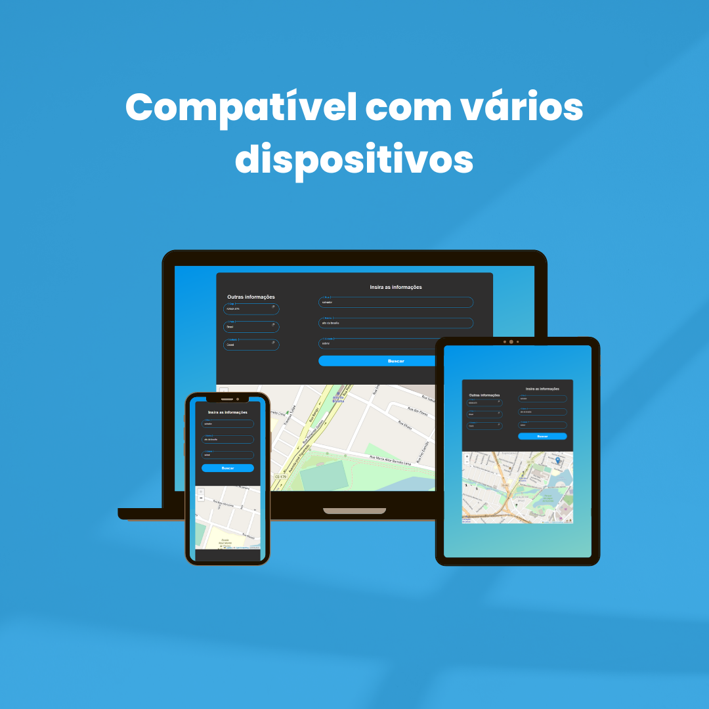

O objetivo principal do projeto é aprimorar minhas habilidades com javaScript. Nesse projeto utilizo duas ferramentas: Nominatim, uma ferramenta de busca de nomes e endereços, que efetua a busca dos dados digitados pelo usuário e retorna as coordenadas geográficas e a Leaflet é uma biblioteca JavaScript de código aberto usada para criar aplicativos de mapeamento da web que consome as coordenadas e as aponta diretamente no mapa. A aplicação possui as seguintes interações:
<ul> 
<li>‣ Pesquisa de endereço baseado na rua, bairro e cidade.</li>
<li>‣ Visualização do endereço pesquisado no mapa.</li>
<li>‣ Copia de dados adicionais como: CEP, estado e país</li>
</ul>

Ferramentas utilizadas:

 

 

Meu linkedin:

 
